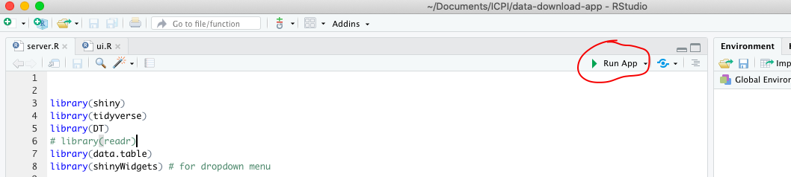
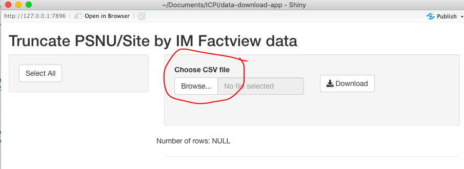

<!-- README.md is generated from README.Rmd. Please edit that file -->

```{r, include = FALSE}
knitr::opts_chunk$set(
  collapse = TRUE,
  comment = "#>"
)
```

# data-download-app

<!-- badges: start -->
<!-- badges: end -->

Data download app was designed to easily wrangle large (rows >1 million) PEPFAR MER quaterly datasets in an flexible, no-code environment.

Once you download or clone with GitHub repo, click on **data-download-app.Rproj** to open the R project file. Make sure you have you have *tidyverse, shiny, shinyWidgets, DT and data.table* packages installed. If not run the following code:

*install.packages(c('tidyverse', 'shiny', 'shinyWidgets', 'DT', 'data.table'))*

Once you have the .Rproj file open (inside RStudio session), open either **ui.r or server.r**. Then click on the arrow next to 

After the app is launched you can use *test_file.txt* in the folder to upload and test the app. Click on *Browse* to upload the data 

Once the data is upload, you can use the filters on the top, to trucate data and download it.